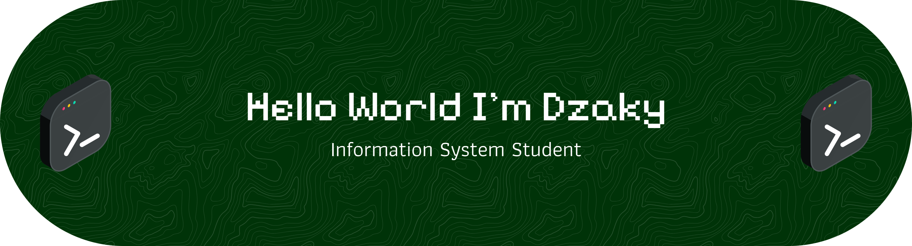

## Hello, Nice to See You! 👋

# 💫 About Me:
I like building things with code and watching ideas turn into something real. Enjoy the process of shaping concepts into functional digital experiences. 

$ whoami
> Information Systems Student
> Full Stack Developer
> Tech Enthusiast

# 🏢 Work Experience

$ current_position
> Role        : Full Stack Developer
> Company     : Scover GTU
> Focus       : End-to-end web development solutions
> Tech Stack  : React, Node.js, PHP, Laravel

$ previous_experience
> Role        : Web Developer Intern
> Company     : ForestTraine
> Achievement : Contributed to forest management systems
> Skills      : Frontend development, API integration

# 🛠 Tech Stack

$ skills --list
> Frontend : HTML, CSS, Bootstrap, React
> Backend  : Node.js, PHP, Laravel
> Database : MySQL
> Tools    : Git, GitHub, VS Code

# 📂 Projects

$ ls projects/
> ZenTick    - Responsive web app (HTML, CSS, Bootstrap)
> Kosmeal    - MVC-based website (PHP)

# 🎓 Education

$ education
> Information Systems - ITPLN

# 📫 Contact

$ connect --with me
> LinkedIn  : https://linkedin.com/in/username
> Portfolio : https://yourwebsite.com
> Email     : your@email.com

#### 🌐 Socials:
   

#### 💻 Tech Stack:
             

#### 📊 GitHub Stats:  
 

#### ✍️  Dev Quote

###

###
